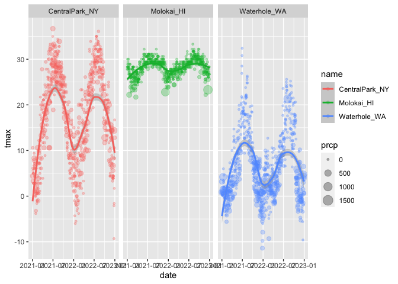

Viz_Part1
================
Jesus Luevano
2023-10-01

``` r
library(tidyverse)
```

    ## ── Attaching core tidyverse packages ──────────────────────── tidyverse 2.0.0 ──
    ## ✔ dplyr     1.1.3     ✔ readr     2.1.4
    ## ✔ forcats   1.0.0     ✔ stringr   1.5.0
    ## ✔ ggplot2   3.4.3     ✔ tibble    3.2.1
    ## ✔ lubridate 1.9.2     ✔ tidyr     1.3.0
    ## ✔ purrr     1.0.2     
    ## ── Conflicts ────────────────────────────────────────── tidyverse_conflicts() ──
    ## ✖ dplyr::filter() masks stats::filter()
    ## ✖ dplyr::lag()    masks stats::lag()
    ## ℹ Use the conflicted package (<http://conflicted.r-lib.org/>) to force all conflicts to become errors

``` r
library(ggridges)
```

Get the data for plotting

``` r
weather_df = 
  rnoaa::meteo_pull_monitors(  #rnoa pulls in specific dataset from weather
    c("USW00094728", "USW00022534", "USS0023B17S"),
    var = c("PRCP", "TMIN", "TMAX"), 
    date_min = "2021-01-01",
    date_max = "2022-12-31") |>
  mutate(
    name = recode( #can also consider case_match or case_when
      id, 
      USW00094728 = "CentralPark_NY", 
      USW00022534 = "Molokai_HI",
      USS0023B17S = "Waterhole_WA"),
    tmin = tmin / 10, #to make whoel degree Celsius
    tmax = tmax / 10) |>
  select(name, id, everything())
```

    ## using cached file: /Users/JML/Library/Caches/org.R-project.R/R/rnoaa/noaa_ghcnd/USW00094728.dly

    ## date created (size, mb): 2023-10-01 15:25:03.322602 (8.525)

    ## file min/max dates: 1869-01-01 / 2023-09-30

    ## using cached file: /Users/JML/Library/Caches/org.R-project.R/R/rnoaa/noaa_ghcnd/USW00022534.dly

    ## date created (size, mb): 2023-10-01 15:25:29.337281 (3.83)

    ## file min/max dates: 1949-10-01 / 2023-09-30

    ## using cached file: /Users/JML/Library/Caches/org.R-project.R/R/rnoaa/noaa_ghcnd/USS0023B17S.dly

    ## date created (size, mb): 2023-10-01 15:25:34.237758 (0.994)

    ## file min/max dates: 1999-09-01 / 2023-09-30

Let’s make a plkot

``` r
ggplot(weather_df, aes(x = tmin, y= tmax)) + #input data, assign axis (but doesn't pull in how to plot)
       geom_point() #decide to give each datapoint a point on plot
```

    ## Warning: Removed 17 rows containing missing values (`geom_point()`).

<!-- -->

``` r
weather_df %>% # can pipe in from dyplr
  ggplot(aes(x = tmin, y = tmax)) + geom_point()
```

    ## Warning: Removed 17 rows containing missing values (`geom_point()`).

<!-- -->

``` r
weather_df %>% # can pipe in from dyplr
  filter(name == "CentralPark_NY") %>%
  ggplot(aes(x = tmin, y = tmax)) + geom_point()
```

<!-- -->

``` r
#save as varibale
ggp_nycweather =
  weather_df %>% 
  filter(name == "CentralPark_NY") %>%
  ggplot(aes(x = tmin, y = tmax)) + geom_point()
```

## Fancy plot tools

``` r
ggplot(weather_df, aes(x = tmin, y = tmax, color = name)) + 
  geom_point() +
  geom_smooth() # fits in line through each colored variable as in ggplot command
```

    ## `geom_smooth()` using method = 'loess' and formula = 'y ~ x'

    ## Warning: Removed 17 rows containing non-finite values (`stat_smooth()`).

    ## Warning: Removed 17 rows containing missing values (`geom_point()`).

<!-- -->

``` r
ggplot(weather_df, aes(x = tmin, y = tmax)) + 
  geom_point(aes(color=name)) +
  geom_smooth() # fits in line through each colored variable, but as color in geom_point only, lines based on info put in on primary ggplot command
```

    ## `geom_smooth()` using method = 'gam' and formula = 'y ~ s(x, bs = "cs")'

    ## Warning: Removed 17 rows containing non-finite values (`stat_smooth()`).
    ## Removed 17 rows containing missing values (`geom_point()`).

<!-- -->

``` r
ggplot(weather_df, aes(x = tmin, y = tmax, color = name)) + 
  geom_point(aes(color = name), alpha = 0.3) + # to make them a bit more translucent
  geom_smooth(se = FALSE) #standard error removed
```

    ## `geom_smooth()` using method = 'loess' and formula = 'y ~ x'

    ## Warning: Removed 17 rows containing non-finite values (`stat_smooth()`).
    ## Removed 17 rows containing missing values (`geom_point()`).

<!-- -->

## Plot with facets

``` r
ggplot(weather_df, aes(x= tmin, y = tmax, color = name)) +
  geom_point(alpha = 0.3) + #alpha blending
  geom_smooth() +
  facet_grid(. ~ name) #one row, separated by name, or name on one row, vs facet_grid( name ~.), generally orders variable based on alphabetical order (but can change up using factors)
```

    ## `geom_smooth()` using method = 'loess' and formula = 'y ~ x'

    ## Warning: Removed 17 rows containing non-finite values (`stat_smooth()`).

    ## Warning: Removed 17 rows containing missing values (`geom_point()`).

<!-- -->

Let’s try a different plot. Temps are boring

``` r
ggplot(weather_df, aes(x= date, y = tmax, color = name)) +
  geom_point(aes(size = prcp), alpha = 0.3) +
  geom_smooth() + 
  facet_grid(. ~ name)
```

    ## `geom_smooth()` using method = 'loess' and formula = 'y ~ x'

    ## Warning: Removed 17 rows containing non-finite values (`stat_smooth()`).

    ## Warning: Removed 19 rows containing missing values (`geom_point()`).

<!-- -->

Try assigning a specific color

``` r
weather_df %>%
  filter(name == "CentralPark_NY") %>%
  ggplot(aes(x = date, y = tmax)) + #taking data and mapping aestehtics to plot
  geom_point(color = "blue") # modifying details of presentation only
```

<!-- -->

``` r
weather_df %>%
  filter(name != "CentralPark_NY") %>%
  #rename(Date = date)
  ggplot(aes(x = date, y = tmax, color = name)) + #taking data and mapping aestehtics to plot
  geom_point(alpha = 0.7, size = 0.5) # modifying details of presentation only
```

    ## Warning: Removed 17 rows containing missing values (`geom_point()`).

<!-- -->

``` r
weather_df %>%
  ggplot(aes(x = tmin, y= tmax)) + 
  geom_hex() #make some heat mapping to data points on plot when lots of data to show
```

    ## Warning: Removed 17 rows containing non-finite values (`stat_binhex()`).

<!-- -->

Line plots!

``` r
#line plots, for longitudinal dataset
weather_df %>%
  filter(name == "Molokai_HI") %>%
  ggplot(aes(x = date, y = tmax)) + 
  geom_line(alpha = 0.5) + 
  geom_point(size = 0.5)
```

    ## Warning: Removed 1 rows containing missing values (`geom_point()`).

<!-- -->

## Univariate plotting

Histogram

``` r
ggplot(weather_df, aes(x= tmax, color = name)) +
  geom_histogram()
```

    ## `stat_bin()` using `bins = 30`. Pick better value with `binwidth`.

    ## Warning: Removed 17 rows containing non-finite values (`stat_bin()`).

<!-- -->

``` r
ggplot(weather_df, aes(x= tmax, fill = name)) + 
  geom_histogram()  #5
```

    ## `stat_bin()` using `bins = 30`. Pick better value with `binwidth`.

    ## Warning: Removed 17 rows containing non-finite values (`stat_bin()`).

<!-- -->

``` r
ggplot(weather_df, aes(x = tmax, fill = name)) +
  geom_histogram(position = "dodge")
```

    ## `stat_bin()` using `bins = 30`. Pick better value with `binwidth`.

    ## Warning: Removed 17 rows containing non-finite values (`stat_bin()`).

<!-- -->

Let’s use density plot

``` r
ggplot(weather_df, aes(x = tmax, fill = name)) +
  geom_density(alpha = 0.3, adjust = 0.5) #sort of smoothed over histogram, alpha for transparency, adjust for smoothness (avoid over- or under-smooothing)
```

    ## Warning: Removed 17 rows containing non-finite values (`stat_density()`).

<!-- -->

Using Boxplots!

``` r
ggplot(weather_df, aes(y = tmax)) + #so vertical
  geom_boxplot()
```

    ## Warning: Removed 17 rows containing non-finite values (`stat_boxplot()`).

<!-- -->

``` r
ggplot(weather_df, aes(y = tmax, x= name)) + #so vertical y first, then x to break up
  geom_boxplot()
```

    ## Warning: Removed 17 rows containing non-finite values (`stat_boxplot()`).

<!-- -->

Violin plots?

``` r
ggplot(weather_df, aes(y = tmax, x= name)) +
  geom_violin() #orient vertically then flip
```

    ## Warning: Removed 17 rows containing non-finite values (`stat_ydensity()`).

<!-- -->

Ridge plot

``` r
ggplot(weather_df, aes(x = tmax, y = name)) +
  geom_density_ridges()
```

    ## Picking joint bandwidth of 1.54

    ## Warning: Removed 17 rows containing non-finite values
    ## (`stat_density_ridges()`).

<!-- -->

## Saving and embedding plots

``` r
ggp_weather =
  weather_df %>%
  ggplot(aes(x = tmin, y = tmax)) + 
  geom_point()

ggp_weather
```

    ## Warning: Removed 17 rows containing missing values (`geom_point()`).

<!-- -->

``` r
ggsave("data/Results/ggp_weather.pdf", ggp_weather)
```

    ## Saving 7 x 5 in image

    ## Warning: Removed 17 rows containing missing values (`geom_point()`).

``` r
ggp_weather
```

    ## Warning: Removed 17 rows containing missing values (`geom_point()`).

<!-- -->

``` r
ggp_weather
```

    ## Warning: Removed 17 rows containing missing values (`geom_point()`).

<!-- -->
