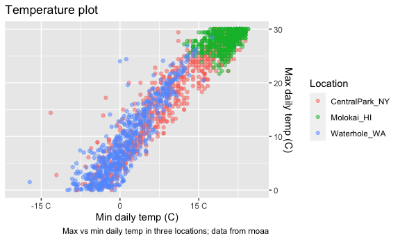
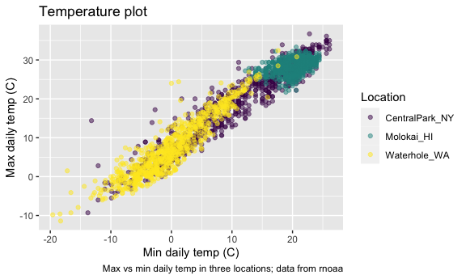

viz_part2
================
Jesus Luevano
2023-10-03

``` r
library(tidyverse)
```

    ## ── Attaching core tidyverse packages ──────────────────────── tidyverse 2.0.0 ──
    ## ✔ dplyr     1.1.3     ✔ readr     2.1.4
    ## ✔ forcats   1.0.0     ✔ stringr   1.5.0
    ## ✔ ggplot2   3.4.3     ✔ tibble    3.2.1
    ## ✔ lubridate 1.9.2     ✔ tidyr     1.3.0
    ## ✔ purrr     1.0.2     
    ## ── Conflicts ────────────────────────────────────────── tidyverse_conflicts() ──
    ## ✖ dplyr::filter() masks stats::filter()
    ## ✖ dplyr::lag()    masks stats::lag()
    ## ℹ Use the conflicted package (<http://conflicted.r-lib.org/>) to force all conflicts to become errors

``` r
library(ggridges)

#Options to set figure wedith/sets for WHOLE RMD
knitr::opts_chunk$set(
  fig.width = 6,
  fig.asp = .6, #keep same ratio based on above width
  out.width = "90%" #take up 90% width of html doc
)
```

Get the data for plotting

``` r
weather_df = 
  rnoaa::meteo_pull_monitors(  #rnoa pulls in specific dataset from weather
    c("USW00094728", "USW00022534", "USS0023B17S"),
    var = c("PRCP", "TMIN", "TMAX"), 
    date_min = "2021-01-01",
    date_max = "2022-12-31") |>
  mutate(
    name = recode( #can also consider case_match or case_when
      id, 
      USW00094728 = "CentralPark_NY", 
      USW00022534 = "Molokai_HI",
      USS0023B17S = "Waterhole_WA"),
    tmin = tmin / 10, #to make whoel degree Celsius
    tmax = tmax / 10) |>
  select(name, id, everything())
```

    ## using cached file: /Users/JML/Library/Caches/org.R-project.R/R/rnoaa/noaa_ghcnd/USW00094728.dly

    ## date created (size, mb): 2023-10-01 15:25:03.322602 (8.525)

    ## file min/max dates: 1869-01-01 / 2023-09-30

    ## using cached file: /Users/JML/Library/Caches/org.R-project.R/R/rnoaa/noaa_ghcnd/USW00022534.dly

    ## date created (size, mb): 2023-10-01 15:25:29.337281 (3.83)

    ## file min/max dates: 1949-10-01 / 2023-09-30

    ## using cached file: /Users/JML/Library/Caches/org.R-project.R/R/rnoaa/noaa_ghcnd/USS0023B17S.dly

    ## date created (size, mb): 2023-10-01 15:25:34.237758 (0.994)

    ## file min/max dates: 1999-09-01 / 2023-09-30

## Same plot from last time

``` r
weather_df %>%
  #filter(tmax >= 20, tmax <=30) %>%
  ggplot(aes(x = tmin, y = tmax, color = name)) + 
  geom_point(alpha = 0.5) + 
  labs(
    title = "Temperature plot",
    caption = "Max vs min daily temp in three locations; data from rnoaa",
    x = "Min daily temp (C)",
    y = "Max daily temp (C)",
    color = "Location"
  ) + 
  scale_x_continuous(
    breaks = c(-15, 0, 15),
    labels = c("-15 C", "0", "15 C")
  ) +
  scale_y_continuous(
    position = "right",
    limits = c(0,30)
  )
```

    ## Warning: Removed 302 rows containing missing values (`geom_point()`).



what about colors…

``` r
weather_df %>%
  #filter(tmax >= 20, tmax <=30) %>%
  ggplot(aes(x = tmin, y = tmax, color = name)) + 
  geom_point(alpha = 0.5) + 
  labs(
    title = "Temperature plot",
    caption = "Max vs min daily temp in three locations; data from rnoaa",
    x = "Min daily temp (C)",
    y = "Max daily temp (C)",
    color = "Location"
  ) + 
  #scale_color_hue(h = c(100,300))
  viridis::scale_color_viridis(discrete = TRUE)
```

    ## Warning: Removed 17 rows containing missing values (`geom_point()`).


